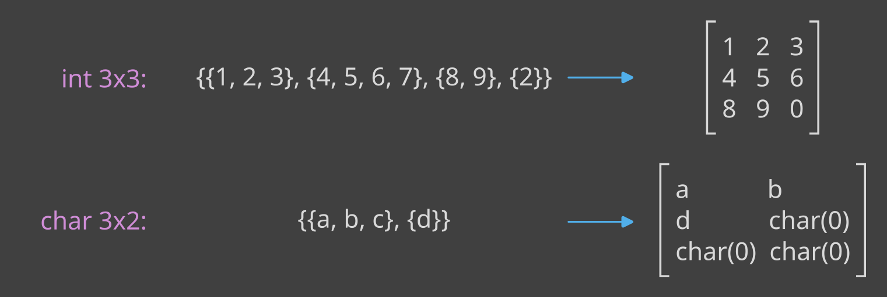
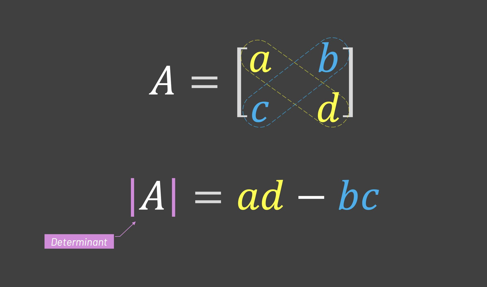

# Zadanie oceniane 7 [15 pkt]
## Szablony

Celem tego laboratorium jest napisanie klasy szablonowej przechowującej macierze dowolnego rozmiaru, zawierające dane dowolnego typu.

> **_Uwaga:_** Wszystkie metody powinny zostać zaimplementowane na zewnątrz definicji klas.

Skorzystaj z dostarczonego pliku [main.cpp](src/main.cpp), w którym umieszczone zostały testy dla wszystkich etapów zadania.
Po zakończeniu implementacji konkretnego etapu odkomentuj odpowiadającą mu część funkcji `main` i porównaj swój wynik z oczekiwanym
(**pamiętaj o załączeniu stworzonych przez ciebie plików w `main.cpp`**).

Dostarczony jest również startowy plik [Makefile](src/Makefile) oraz plik z poprawnym wynikiem działania programu: [output](output.txt)

## Pliki startowe

[Makefile](src/Makefile)

[main.cpp](src/main.cpp)

[output.txt](src/output.txt)

### Etap 1: Definicja szablonowej klasy Matrix, konstruktor, operator<< [4 pkt]

W pliku `matrix.hpp` zdefiniuj klasę szablonową `Matrix`, posiadającą 3 argumenty szablonowe:
- `T` będący typem przechowywanych wartości,
- `Rows` typu size_t, będący ilością wierszy macierzy,
- `Cols` typu size_t, będący ilością kolumn macierzy.
Ustaw domyślne wartości `Rows` i `Cols` na 4.

W klasie `Matrix` stwórz prywatne pole `elements` będące tablicą dwuwymiarową o odpowiedniej ilości kolumn i wierszy. 

Uwaga! Nie alokuj pamięci dynamicznie! Skorzystaj z argumentów szablonowych do stworzenia tablicy o odpowiednim rozmiarze. 
Tablica powinna zostać uzupełniona domyślnymi wartościami dla przechowywanego typu danych.

Zaimplementuj konstruktor przyjmujący jako argument listę inicjalizacyjną `std::initializer_list<std::initializer_list<T>> list` zgodnie z zasadami:
- Kolejne elementy zewnętrznej listy powinny zostać wstawione w kolejne rzędy macierzy. 
- Jeśli elementów w liście zewnętrznej jest więcej niż rzędów macierzy, powinny one zostać odrzucone (nie zostaną wpisane do macierzy).
- Jeśli elementów w którejś z list wewnętrznych jest więcej niż liczba kolumn macierzy, należy pominąć nadmiarowe elementy. 
- Jeśli brakuje elementów do wypełnienia macierzy, w dane pola powinny zostać wpisane domyśle wartości dla danego typu danych.

Np.:



Zaimplementuj `operator<<` wypisujący elementy macierzy z odpowiednią liczbą wierszy i kolumn.

### Etap 2: Operator[], operator+, operator-, metoda transpose()  [4 pkt]

Zaimplementuj `operator[]`, który wydobywa element o odpowiednim indeksie. Powinien wydobyć zarówno cały wiersz w przypadku podania jednego argumentu, jak i element tablicy w przypadku podania dwóch indeksów.

Zaimplementuj `operator+` zwracający nową macierz będącą sumą dwóch macierzy.
Zaimplementuj `operator-` zwracający nową macierz będącą różnicą dwóch macierzy.

Do klasy `Matrix` dodaj metodę `transpose()`. Powinna ona zwracać nową macierz będącą transpozycją bieżącej macierzy.

> **_Uwaga:_** W zależności od implementacji, może być wymagany konstruktor bezparametrowy. Można użyć w tym celu domyślnego konstruktora.

### Etap 3: Klasa pochodna SquareMatrix [4 pkt]

W pliku `square_matrix.hpp` zdefiniuj klasę szablonową `SquareMatrix` będącą klasą pochodną klasy `Matrix`. Powinna ona posiadać 2 argumenty szablonowe:
- `T` będący typem przechowywanych wartości,
- `N` typu size_t, będący ilością wierszy/kolumn macierzy.
Ustaw domyślną wartość `N` na 4.

Macierze kwadratowe posiadają wyznaczniki. W klasie `SquareMatrix` utwórz prywatne pole `det` przechowujące wyznacznik macierzy. Powinien on zostać obliczony w momencie stworzenia macierzy.
W tym celu utwórz prywatną metodę pomocniczą `T computeDeterminant()`, która obliczy wyznacznik macierzy zgodnie z algorytmem (który możesz skopiować):
```cpp
    T A[N][N];
    std::copy(&elements[0][0], &elements[0][0] + N * N, &A[0][0]);
    int swaps = 0;

    for (std::size_t i = 0; i < N; ++i) {
        std::size_t maxRow = i;
        for (std::size_t k = i + 1; k < N; ++k) {
            if (std::abs(A[k][i]) > std::abs(A[maxRow][i]))
                maxRow = k;
        }

        if (std::abs(A[maxRow][i]) < 1e-12)
            return T{};

        if (i != maxRow) {
            std::swap_ranges(A[i], A[i] + N, A[maxRow]);
            swaps++;
        }

        for (std::size_t k = i + 1; k < N; ++k) {
            T factor = A[k][i] / A[i][i];
            for (std::size_t j = i; j < N; ++j)
                A[k][j] -= factor * A[i][j];
        }
    }

    T determinant = (swaps % 2 == 0) ? 1 : -1;
    for (std::size_t i = 0; i < N; ++i)
        determinant *= A[i][i];

    return determinant;
```

Zaimplementuj publiczny getter `getDet()`, który zwróci wartość prywatnego pola `det`. 

Zaimplementuj statyczną metodę `identity()`, która będzie metodą fabryczną zwracającą nowe macierze jednostkowe, ustawiając na przekątnej 1 oraz w pozostałych miejscach 0.

### Etap 4: Specjalizacja klasy SquareMatrix [3 pkt]

Zaimplementuj specjalizację klasy szablonowej `SquareMatrix` dla rozmiaru równego 2.

Dla macierzy 2x2 dużo łatwiej jest obliczyć wyznacznik: wystarczy policzyć iloczyny na przekątnych macierzy i odjąć je od siebie:



W specjalizacji klasy `SquareMatrix` dla rozmiaru równego 2 zaimplementuj powyższą metodę liczenia wyznacznika. W metodzie wypisz komunikat "Calculating determinant in 2x2 square matrix class specialization".

> **_Uwaga:_** Specjalizacja klasy może wymagać implementacji innych metod z klasy `SquareMatrix`.

## Rozwiązania

[main.cpp](solution/main.cpp)

[matrix.hpp](solution/matrix.hpp)

[square_matrix.hpp](solution/square_matrix.hpp)
