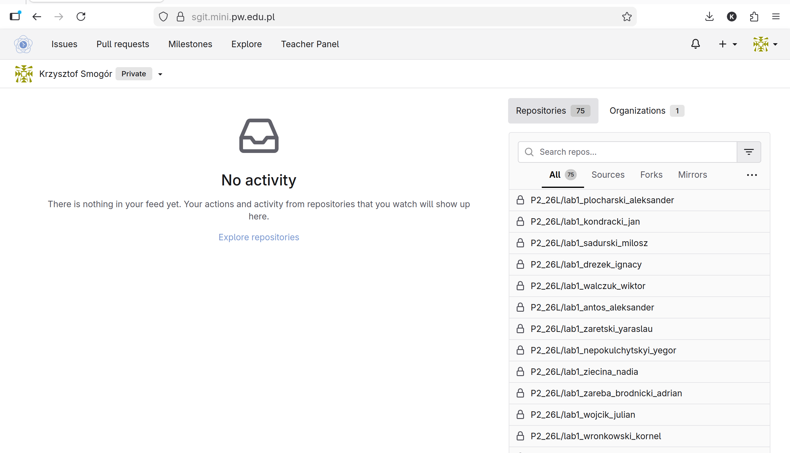
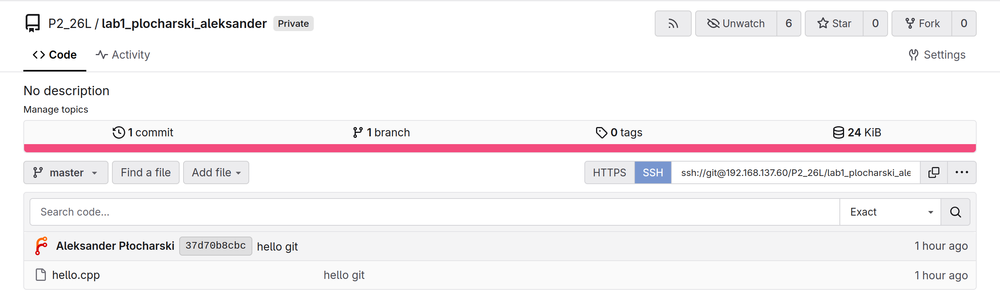
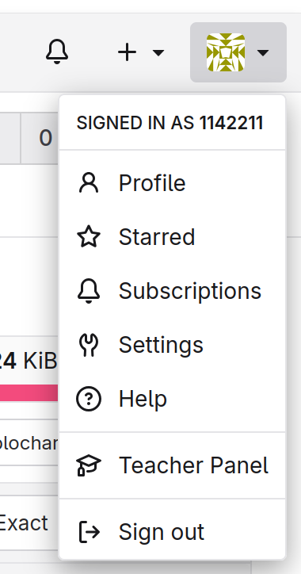
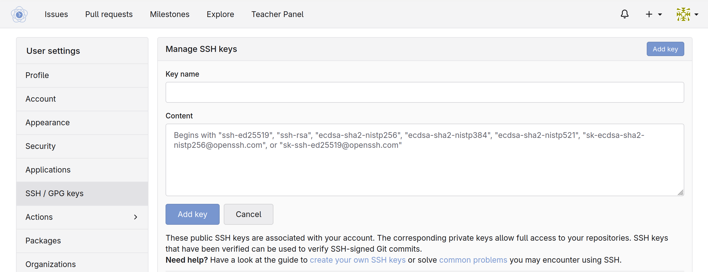

# Laboratorium 0

## Środowisko programistyczne
Zanim przejdziemy do właściwej treści, musimy wybrać edytor, w którym będziemy pisali kod.
W poprzednim semestrze było to Visual Studio.
Nie ma ono swojej wersji na Linuxa (wielu programistów powiedziałoby: i bardzo dobrze, nie chcemy go).
W naszym laboratorium dostępne jest:
- Visual Studio Code -- niemające wiele wspólnego z Visual Studio środowisko (też wydawane przez Microsoft). Ma mniejszą funkcjonalność, ale dzięki temu jest znacznie szybsze i lżejsze.
- CLion -- cięższe środowisko mające bardziej rozbudowaną funkcjonalność, bardziej przypominające Visual Studio.
- Vim -- edytor tekstowy w terminalu. Bez odpowiedniej konfiguracji korzystanie z niego byłoby bardzo nieprzyjemne. Wbrew pozorom pozwala jednak na bardzo wiele rozszerzeń. Możliwości rozbudowy są jednak znacznie większe, niż w wymienionych wyżej edytorach.
- Emacs -- edytor tekstowy, który podobnie jak vim, pozwala na dowolne rozbudowywanie funkcjonalności.
- Geany -- prosty edytor tekstowy, bez wielkich możliwości rozbudowy.

Wybór środowiska zależy od każdego indywidualnie.
Na początek zarekomendowałbym Visual Studio Code lub CLion.
Osoby bardziej ambitne, chcące zbudować sobie swoje własne środowisko od podstaw zachęcam do spróbowania Vima lub Emacsa. W internecie znajdziemy setki poradników, jak to zrobić.

Na kolejnych laboratoriach, w szczególności na laboratoriach ocenianych, zakładamy znajomość z wybranym środowiskiem.

## Kompilowanie programów
Kiedy twój edytor stoi już przed tobą otworem, sprawdźmy zatem, czy działa jak należy.
Jako pierwsze zadanie stwórz program, wypisujący twoje:
1. imię,
2. nazwisko,
3. nr indeksu.

W przeciwieństwie do poprzedniego semestru tutaj będziemy używać **C++**.
Poniżej znajdziesz najprostszy program wypisujący wybrany tekst na standardowe wyjście.

```cpp
// Wczytanie definicji funkcji operujących na strumieniach wejścia-wyjścia 
// (analogiczne do <stdio.h> z C)
#include <iostream> 

int main()
{
  // Wypisanie ciągu na standardowe wyjście oraz zakończenie znakiem końca linii 
  // (analogiczne do puts z C)
  std::cout << "Jan Dzban, 123456" << std::endl;
  return 0;
}
```

Powyższy program po rozpoczęciu wypisuje na standardowe wyjście tekst znajdujący się w kodzie i od razu się kończy.
Więcej szczegółów obsługi strumieni w C++ dowiesz się na kolejnych warsztatach.

Stwórz plik o nazwie `hello.cpp` i otwórz go za pomocą twojego edytora.
Skopiuj przykład i zmień jego zawartość na dane opisujące ciebie.
Gdy plik będzie gotowy, uruchom terminal w miejscu utworzenia pliku.
Każde ze środowisk programistycznych powinno mieć opcję uruchomienia terminala w ramach swojego okna.
Skonsultuj dokumentację środowiska, aby odnaleźć tę funkcję.
Będzie bardzo przydatna przez cały semestr.
Jeśli nie uda ci się znaleźć tej funkcji, uruchom terminal w oddzielnym oknie.

Teraz należy **skompilować** program, aby komputer mógł wykonać przekazane mu instrukcje w języku **C++**.
Do tego zadania służy **kompilator**.
Każdy szanujący się system operacyjny dostarczany jest z pewnym kompilatorem języka C.
W dużej mierze w komplecie instalowane są także kompilatory języka C++.
W przypadku naszego laboratorium mamy do dyspozycji kompilatory **GCC** (GNU Compiler Collection).
Interesować nas będzie program o nazwie `g++`, który jest kompilatorem języka C++.

Skompiluj swój przykładowy program poleceniem
```sh
g++ -o hello hello.cpp
```
Powyższe polecenie uruchamia kompilator i instruuje go, aby potraktował plik `hello.cpp` jako kod źródłowy (wejście) oraz wygenerował gotowy program wykonywalny o nazwie `hello` (wyjście).
Jeśli kod posiada błędy (jest niezgodny ze składnią języka C++), kompilator wypisze błąd i zakończy się niepowodzeniem.
W przeciwnym wypadku w bieżącym katalogu roboczym stworzony zostanie plik `hello`, który można uruchomić poleceniem
```sh
./hello
```
Dla przykładowego programu wyjście powinno wyglądać
```
Jan Dzban, 123456
```

Gdy już mamy możliwość pisania kodu, możemy przejść do dzielenia się nim z innymi programistami.

## Git
Git (z ang. „głupek”) jest programem, tak zwanym **systemem kontroli wersji**, którego współcześnie używa praktycznie każdy programista.
Pozwala on na udostępnianie kodu źródłowego między programistami i modyfikowanie go (zamiast np. wysyłania sobie ręcznie mailem plików z kodem).
W połączeniu z serwerem (często github.com) pozwala na przechowywanie kodu w chmurze (czyli na cudzym komputerze).
W przypadku naszych laboratoriów Git posłuży nam do współdzielenia kodu między studentami a prowadzącymi.
Każde zadanie oceniane będzie udostępniane w tak zwanym **repozytorium**.
Umiejętność korzystania z Gita jest obowiązkowa na wszystkich laboratoriach ocenianych w zakresie pozwalającym na przekazanie rozwiązania zadania laboratoryjnego.
Tylko kod znajdujący się w repozytorium na koniec zajęć podlega ocenie!

Poniżej znajduje się prosta instrukcja korzystania z Gita.
Osoby zainteresowane zachęcam do głębszego zapoznania z tematem, w szczególności dzięki oficjalnej [książce](https://git-scm.com/book/en/v2).

### 1. Konfiguracja Gita
Przed pierwszym użyciem należy skonfigurować swoją tożsamość:
```sh
git config --global user.name "Twoje Imię i Nazwisko"
git config --global user.email "twoj@email.com"
```
Możesz sprawdzić swoją konfigurację za pomocą:
```sh
git config --list
```
To działanie jest wymagane tylko raz.

#### 2. Podstawowe operacje
Każdy projekt związany jest z repozytorium -- to w nim przechowywany jest kod i jego historia.
Utwórz nowe repozytorium i spróbuj wykonać na nim poniższe operacje.

Aby utworzyć repozytorium w aktualnym folderze, należy wykonać
```sh
git init
```

Każdy nowy plik musi zostać dodany do Gita, aby go śledzić:
```sh
git add <nazwa pliku>
```
Do gita dodajemy tylko kod źródłowy (w tym pliki `Makefile`).
Nie dodajemy nigdy plików, które powstają przy kompilacji!

Aby sprawdzić, jakie pliki zostały zmodyfikowane od ostatniego zapisania zmian:
```sh
git status
```

Zatwierdzenie zmian zapisuje je w historii repozytorium:
```sh
git commit -m "Opis zmian"
```

Aby sprawdzić historię zapisanych zmian, możemy użyć
```sh
git log
```

#### 3. Repozytoria zdalne - *remote*
Repozytoria możemy tworzyć lub **klonować** z serwera.
W przypadku tych zajęć repozytoria będą klonowane przez każdego studenta.

Do tego celu użyjemy systemu `sgit.mini.pw.edu.pl`.
Proszę udać się na tę stronę i zalogować się kontem PW CAS.
Od momentu zalogowania na stronie głównej powinny pokazać się repozytoria dostępne dla użytkownika.



Namierz repozytorium o nazwie `lab1_{nazwisko}_{imie}` i kliknie w nie lewym przyciskiem myszy.
W prawym górnym rogu powinien pojawić sie odnośnik do wykonania operacji **clone**.



Aby wykonać operacje clone, wydaj następujące polecenie
```bash
git clone <adres zdalnego repozytorium>
```
Polecenie powinno zapytać o hasło i użytkownika.
Oznacza to, że nie jesteś autoryzowany do dostępu.

Na czas laboratorium wykorzystamy protokół `ssh`, aby mieć dostęp do swojego repozytorium.
W tym celu należy przygotować **klucz ssh**, który pozwoli zidentyfikować, kim jesteśmy i jakie repozytoria możemy pobierać.

Wykonaj następujące polecenia
```bash
ssh-keygen -t ed25519 -f ~/.ssh/sgit_id
chmod 600 ~/.ssh/sgit_id
cat ~/.ssh/sgit_id.pub
```
W momencie pytania o hasło do klucza proszę nacisnąć enter bez wpisywania niczego.
Ostatnia linia jest **kluczem publiczym**, który musimy umieścić w systemie **sgit**.
W tym celu proszę udać się do ustawień konta w prawym górnym rogu



Tam znajdź sekcję *SSH / GPG Keys*, w której należy dodać nowy klucz i wkleić zawartość **klucza publicznego**.




Od tego momentu przy próbie wykonania operacji klonowania przy pomocy adresu SSH
```bash
git clone ssh://git@192.168.137.60/P2_26L/lab1_{nazwisko}_imie.git
```
powinien utworzyć się folder z pustym repozytorium.
Można potwierdzić prawidłowo skonfigurowane zdalne repozytorium poprzez wykonanie polecenia
```bash
git remote
```
Powinien być widoczny jeden remote o nazwie **origin**.
Od tego momentu 

## Zadanie na dziś -- zaznaczenie obecności

Aby potwierdzić działanie twojej konfiguracji gita, twoim zadanie jest przesłanie przykładowego programu do repozytorium udostępnionego w ramach systemu ghlabs.
Wykonaj następujące kroki:
1. Odnajdź przyporządkowane do ciebie repozytorium o nazwie podobnej do `WUT-MiNI/P2_26L_{USOS_ID}_L0`.
2. Wykonaj operację `git clone`.
3. Skopiuj plik `hello.cpp` (nie kopiuj pliku `hello` - to każdy może utworzyć z kodu źródłowego).
4. Dodaj pliki do śledzonych poleceniem `git add hello.cpp`.
5. Potwierdź status repozytorium poprzez `git status`.
6. Zatwierdź zmiany w repozytorium wykonując `git commit -m "Example hello program"`.
7. Wyślij zmiany do zdalnego repozytorium poprzez polecenie `git push`.

## Posłowie -- dostęp do repozytoriów sgit spoza wydziału
