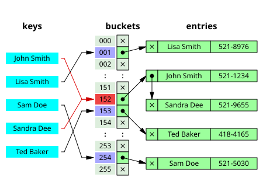

# Laboratorium 7
## Szablony

### Wprowadzenie

Szablony w C++ to ważny mechanizm pozwalający tworzyć klasy i funkcje, które działają z różnymi typami danych. Dzięki nim możemy pisać uniwersalny, wielokrotnego użytku kod, bez potrzeby powielania tej samej logiki dla każdego typu.

Szablony są powszechnie wykorzystywane, m.in. w implementacjach kontenerów — takich jak `std::vector`, `std::map` czy `std::set` — ponieważ pozwalają przechowywać dowolny typ danych. Kontener zdefiniowany jako szablon może działać zarówno z typami prostymi (`int`, `double`), jak i z bardziej złożonymi (np. `std::string` czy własne struktury).

Dzisiejsze zadanie polega na stworzeniu szablonu klasy `Dictionary`, która będzie mogła działać na dowolnych typach kluczy oraz wartości.

Ale zanim to nastąpi, przypomnijmy czym jest słownik w kontekście struktury przechowującej dane, oraz jak może zostać on zaimplementowany.

### Słownik

Słownik (ang. dictionary lub map) to struktura danych, która pozwala przechowywać i wyszukiwać wartości na podstawie unikalnych kluczy.

Przykładowo, jeśli chcemy policzyć wystąpienia słów w tekście, możemy przypisać każdemu słowu licznik, który zlicza jego liczbę pojawień. Takie przypisanie słowo &rarr; liczba to właśnie przykład działania słownika.

Taka struktura mapuje wartości jednego typu na wartości drugiego typu, dlatego tego rodzaju struktura danych w C++ nazwana jest `std::map` (lub `std::unordered_map`).

Dzisiejsza implementacja słownika będzie odpowiadać `std::unordered_map` z biblioteki standardowej.

#### Implementacja

Słownik zwykle jest implementowany za pomocą tablicy elementów `KeyValuePair`, z których każdy przechowuje dwa pola: klucz oraz wartość.

W `std::map` nowe elementy zostają wstawione na odpowiednie miejsce w kolejności wyznaczonej przez klucz, natomiast w `std::unordered_map` pozycja nowego elementu zostaje ustalona za pomocą funkcji hashującej.

Funkcja hashująca może być dowolną funckją, która na podstawie dowolnego obiektu ustali unikalny indeks. Może się niestety zdarzyć, że obliczony indeks będzie taki sam dla dwóch różnych kluczy - następuje wtedy tak zwana kolizja hashy. Jednym ze sposobów poradzenia sobie z takimi samymi hashami jest metoda "separate chaining", w której łączymy wszystkie elementy o tym samym hashu w listę jednokierunkową (Linked List).

W celu przećwiczenia tematu szablonów, zalecamy implementację ciała metod poza definicją klasy. Klasy powinny być napisane od zera.

Skorzystaj z dostarczonego plików: [Makefile](src/Makefile), [main.cpp](src/main.cpp), w którym umieszczone zostały testy do wszystkich etapów zadania oraz [Hash.hpp](src/Hash.hpp) w późniejszych etapach zadania. 
Po zakończeniu implementacji konkretnego etapu odkomentuj odpowiadającą mu część funkcji `main()` i porównaj swój wynik z oczekiwanym (**pamiętaj o załączeniu stworzonych przez ciebie plików w main.cpp**).

### Etap 1: Definicja szablonowej klasy KeyValuePair

W pliku `Dictionary.hpp` zdefiniuj strukturę szablonową `KeyValuePair`. Powinna ona przechowywać pola:
- klucz `key` typu szablonowego `K`,
- wartość `value` typu szablonowego `V`,
- wskaźnik na następny element `KeyValuePair` listy jednokierunkowej.

Zaimplementuj konstruktor przyjmujący jako argument zarówno klucz, jak i wartość oraz ustaw wartość wskaźnika na `nullptr`.

### Etap 2: Definicja szablonowej klasy Dictionary

W tym samym pliku poniżej stwórz klasę szablonową `Dictionary`, posiadającą 3 argumenty szablonowe:
- `K` będący typem klucza,
- `V` będący typem wartości,
- `Capacity` typu int, będący rozmiarem wewnętrznej tablicy wartości.

Klasa powinna zawierać:
- pole: `table` będące tablicą wskaźników na `KeyValuePair`,
- konstruktor: inicjalizujący tablicę `table` wartością `nullptr`.
- destruktor: zwalniający pamięć elementów tablicy oraz elementów listy jednokierunknowych, jakie zostały stworzone w trakcie wstawiania elementów.
- metody:
    - `hash(const K& key)`, przyjmującą klucz i na jego podstawie zwracającą wartość typu `size_t`. Do implementacji tej metody użyj hashera znajdującego się w pliku `Hash.hpp`. Użyj operatora modulo (`%`) z parametrem `Capacity`, aby zwracana wartość zawsze mieściła się w zakresie tablicy.
    - `insert(const K& key, const V& value)`, wstawiająca wartość dla podanego klucza. W celu znalezienia indeksu w tablicy table, użyj funkcji `hash`. Jeśli na podanym indeksie nie istnieje jeszcze element, należy go tam wstawić. Jeśli istnieje, należy przejść po liście jednokierunkowej, i na jej końcu wstawić nowy element o podanym kluczu i wartości.
- operator: `operator<<`, który wypisze wszystkie istniejące pary klucz-wartość w słowniku.

### Etap 3: Operator[] oraz funkcje get i remove

Do klasy `Dictionary` dodaj:
- operator: `operator[]` który dla zadanego klucza zwróci referencję na wartość. Jeśli klucz nie istnieje w słowniku, należy stworzyć odpowiedni wpis w słowniku i zainicjalizować go domyślną wartością.
- metody: 
    - `std::optional<V> get(const K& key) const`, która pozyskuje element o odpowiednim kluczu i zwraca `std::optional` zawierający wartość. Jeśli klucz nie istnieje, metoda zwraca pusty `std::optional`.
    - `bool remove(const K& key)`, która usuwa element o odpowiednim kluczu. W przypadku udanej operacji zwraca `true`, w.p.p. `false`.

### Etap 4: Specjalizacja struktury Hash

Jeśli kluczem w słowniku jest wartość typu `int`, możemy uznać, iż hashowanie jest niepotrzebne w takim wypadku i wartość klucza będzie zwracaną wartością indeksu.
Napisz specjalizację struktury `Hash` dla typu `int`, która w operatorze `operator()` zwróci kolejne wartości naturalne dla kolejnych wartości klucza, tzn. dla 1 zwróci wartość 1, dla 2 - 2, itd. 

### Etap 5: Metoda intersect

Zaimplementuj metodę `void intersect(const Dictionary& other) const`, która zwróci nowy słownik zwierający elementy o kluczach, które znajdują się w obu słownikach jednocześnie. Wartość dla danego klucza może zostać wzięta z dowolnego słownika.

### Etap 6: Operator+

Zaimplementuj operator `operator+`, który zwróci słownik zawierający elementy o wszystkich kluczach znajdujących się w pierwszym bądź w drugim słowniku. Jeśli w słownikach znajduje się element o tym samym kluczu, jego wartość może zostać wzięta z dowolnego słownika.

### Rozwiązanie

[Dictionary.hpp](solution/Dictionary.hpp)  
[Hash.hpp](solution/Hash.hpp)  
[main.cpp](solution/main.cpp)  
[Makefile](solution/Makefile)  