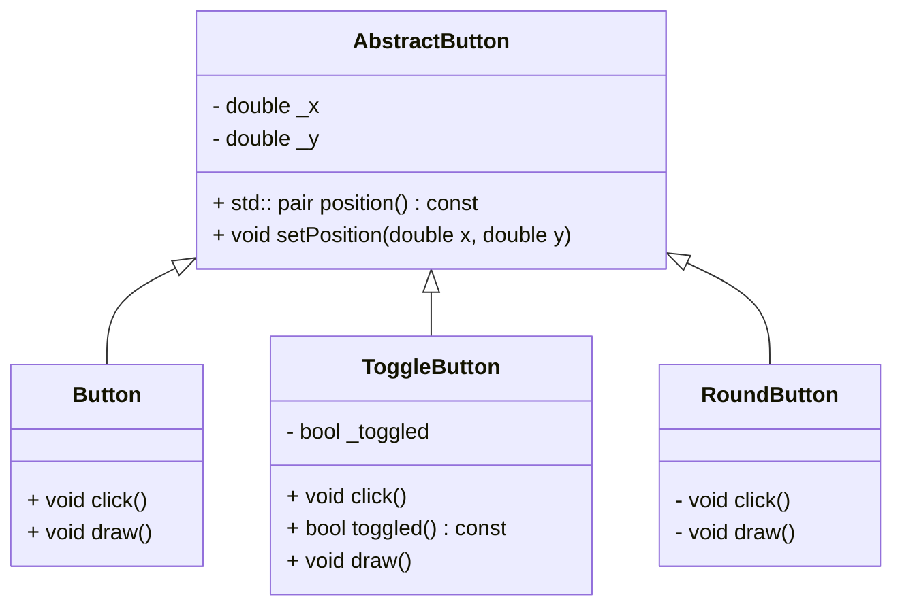
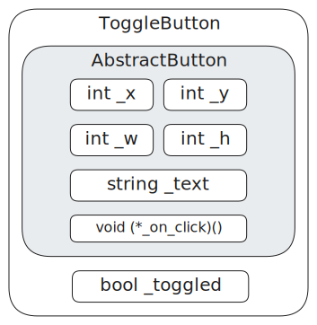

# Wykład 6 - Polimorfizm i Wyjątki

* Dziedziczenie
* Funkcje wirtualne
* RTTI
* Wyjątki
* `std::error_code`
* Funkcje lambda
* `std::function`

## Dziedziczenie

Typy obiektów w programowaniu obiektowym bywają bardzo podobne. Mogą współdzielić
między sobą dużą część stanu i/lub zachowania. Rozważmy przykład modelujący różne przyciski w aplikacji graficznej:

```cpp
class Button {
    double _x = 0, _y = 0;
    double _w = 100, _h = 50;
    std::string _text;
    void (*_on_click)() = nullptr;

   public:
    Button() = default;
    std::pair<double, double> position() const { return {_x, _y}; }
    void setPosition(double x, double y) { _x = x; _y = y; }
    std::pair<double, double> size() const { return {_w, _h}; }
    void setSize(double w, double h) { _w = w; _h = h; }
    const std::string& text() const { return _text; }
    void setText(const std::string& text) { _text = text; }
    void setOnClick(void (*fn)()) { _on_click = fn; }
    void click() {
        _on_click();
    }
    void draw();
};

class ToggleButton {
    double _x = 0, _y = 0;
    double _w = 100, _h = 50;
    std::string _text;
    void (*_on_click)() = nullptr;
    bool _toggled = false;

   public:
    /* duplikacja */
    void click() {
        _toggled = !_toggled;
        _on_click();
    }
    bool toggled() const { return _toggled; }
    void draw();
};

class RoundButton {
    double _x = 0, _y = 0;
    double _r = 50;
    std::string _text;
    void (*_on_click)() = nullptr;
   private:
    RoundButton() = default;
    std::pair<double, double> position() const { return {_x, _y}; }
    void setPosition(double x, double y) { _x = x; _y = y; }
    double radius() const { return _r; }
    void setRadius(double r) { _r = r; }
    const std::string& text() const { return _text; }
    void setText(const std::string& text) { _text = text; }
    void setOnClick(void (*fn)()) { _on_click = fn; }
    void click() {
        _on_click();
    }
    void draw(); // draws rounded edges
};
```

Source: [button.cpp](button.cpp)

Trzy klasy różnią się bardzo nieznacznie. `ToggleButton` dodaje drobną logikę przechowującą stan wciśnięcia.
`RoundButton` różni się tylko w wewnętrznej implementacji rysowania. Podobieństwo trzech klas wynika z tego, że modelują
prawie te same typy. `Button`, `ToggleButton` i `RoundButton` to wszystko **są przyciski**. Widać więc relację 1 do
wielu
z pewnym uproszczonym typem modelującym wspólne elementy stanu i zachowania: uproszczonym przyciskiem.

Relację między typami _A to B_, _obiekty A to też obiekty typu B_ implementujemy w językach obiektowych za pomocą
mechanizmu **dziedziczenia**. W C++ definicja klasy może specyfikować jeden lub wiele typów bazowych, których
stan i zachowanie zostaną automatycznie włączone w typ pochodny.

```cpp
class AbstractButton {
    double _x = 0, _y = 0;
    double _w = 100, _h = 50;
    std::string _text;
   protected:
    void (*_on_click)() = nullptr;

   public:
    AbstractButton() = default;
    std::pair<double, double> position() const { return {_x, _y}; }
    void setPosition(double x, double y) { _x = x; _y = y; }
    std::pair<double, double> size() const { return {_w, _h}; }
    void setSize(double w, double h) { _w = w; _h = h; }
    const std::string& text() const { return _text; }
    void setText(const std::string& text) { _text = text; }
    void setOnClick(void (*fn)()) { _on_click = fn; }
};

class Button : public AbstractButton {
  public:
    void click() {
        _on_click();
    }
    void draw();
};

class ToggleButton : public AbstractButton {
    bool _toggled = false;

   public:
    void click() {
        _toggled = !_toggled;
        _on_click();
    }
    bool toggled() const { return _toggled; }
    void draw();
};

class RoundButton : public AbstractButton  {
   public:
    void click() {
        _on_click();
    }
    void draw(); // draws rounded edges
};
```

Source: [abstract_button.cpp](abstract_button.cpp)

Wspólne pola (elementy stanu) zostały wydzielone do klasy bazowej `AbstractButton`.
Podobnie, wspólne metody (elementy zachowania), charakterystyczne dla dowolnego przycisku stały się częścią klasy
bazowej.

Klasy pochodne definiują swoją bazę za pomocą składni `class A : public B { ... };` wymieniając po dwukropku
klasy, z których dziedziczą. Obiekty klas pochodnych posiadają pola i metody wszystkich klas bazowych, co można
zaobserwować, np. wywołując metody:

```cpp
void do_click() {
    std::cout << "click" << std::endl;
}

int main() {
     Button b;
     b.setText("Button");
     b.setPosition(0, 0);
     b.setOnClick(do_click);
     ToggleButton tb;
     tb.setText("Toggle");
     tb.setPosition(100, 0);
     tb.setOnClick(do_click);
     RoundButton rb;
     rb.setText("Round");
     rb.setPosition(200, 0);
     rb.setOnClick(do_click);

     b.click();
     tb.click();
     rb.click();

     return 0;
}
```

Relacja dziedziczenia pozwala mówić o skierowanym grafie zależności
między typami. Pracując z projektami złożonymi z wielu klas, często można spotkać diagramy
prezentujące hierarchię dziedziczenia, np. _diagramy klas_:



Technicznie, każdy obiekt klasy pochodnej zawiera pod-obiekt klasy pochodnej, a w nim, wszystkie jego składowe.
Różnica między dziedziczeniem, a zwyczajnym zadeklarowaniem podobiektu polega na tym, że nazwy składowych podobiektu
są włączane w zakres nazw składowych obiektu dziedziczącego.



Hierarchia dziedziczenia może być dowolnie zagłębiona:

```cpp
class A { ... };
class B : public A { ... };
class C : public B { ... };
```

### Przysłanianie

Klasa pochodna może definiować swoje składowe, rozszerzając funkcjonalność klasy bazowej.
Nasuwa się pytanie: co, jeżeli nazwie je tak samo, jak istniejące składowe w bazie?

```cpp
class Base
{
public:
    int value = 10;
    void bump() { value++; }
};

class Derived : public Base
{
public:
    int value = 20;
    void bump() { value--; }  // Które to value?
};

Derived d; // Jaka jest wartość d.value?
std::cout << d.value << std::endl;
d.bump(); // Która to metoda? Którego `value` użyje?
std::cout << d.value << std::endl;
```

Source: [shadowing.cpp](shadowing.cpp)

Obiekty klasy `Derived` posiadają dwa pola o nazwie `value` i dwie metody `bump`. Nazwy wymienione w ciele
klasy pochodnej **przysłaniają** te z klasy bazowej, przez co wyrażenia `d.bump()` i `d.value`
odnoszą się do metody i składowej zdefiniowanej przez klasę `Derived`.

Można jawnie odnieść się do składowej z bazy prefiksując nazwę operatorem zakresu:

```cpp
class Derived : public Base {
public:
    // ...
    void bump_base() { Base::bump(); }
};

d.Base::bump();
std::cout << d.Base::value << std::endl;
```

Obiekt `d` typu `Derived` zawiera zatem dwa niezależne podobiekty `value` typu `int`, o czym można przekonać się,
chociażby patrząc na ich adresy:

```cpp
Derived d;
std::cout << d.value << " at " << static_cast<void*>(&d.value) << std::endl;
std::cout << d.Base::value << " at " << static_cast<void*>(&d.Base::value) << std::endl;
```

```text
19 at 0x7ffd25ffa6b4
11 at 0x7ffd25ffa6b0
```

### Widoczność

Jaka jest widoczność odziedziczonych składowych? To zależy od dwóch czynników:

1) Od ich widoczności zdefiniowanej w klasie bazowej
2) Od typu dziedziczenia określonego na liście klas bazowych

Klasa pochodna określa, jaka ma być widoczność odziedziczonych składowych poprzedzając klasy bazowe na liście
dziedziczenia słowami `public`, `private` lub `protected`. Mówi w ten sposób o tym, czy
dziedziczymy w trybie publicznym, prywatnym lub chronionym. Dla klas domyślnym trybem jest `private`,
dla struktur: `public`.

Niezależnie od trybu dziedziczenia, składniki prywatne klasy bazowej są niedostępne dla nikogo,
nawet dla klasy dziedziczącej! To dobrze, bo inaczej moglibyśmy złamać hermetyzację podobiektu bazowego.

```cpp
class Base
{
private:
    int x = 1;

protected:
    int y = 2;

public:
    int z = 3;
};

class DerivedPublic : public Base
{
public:
    void foo()
    {
        // x *= 2; // Błąd! x to prywatna składowa Base
        y *= 2;
        z *= 2;
    }
};

DerivedPublic pub;
// pub.x *= 2;  // Błąd! x nie jest publiczną składową DerivedPublic
// pub.y *= 2;  // Błąd! y ma widoczność protected
pub.z *= 2;     // ok, z jest public
```

Przy dziedziczeniu publicznym, składniki `protected` pozostają `protected`, a składniki `public` pozostają `public`.
Dostęp do składowych `protected` będzie miała zatem klasa pochodna, ale nikt z zewnątrz. To najpowszechniejszy tryb
dziedziczenia, oznaczający naturalne rozszerzanie klasy bazowej. Słowo `protected` oznacza więc _dostępne, ale tylko
dla implementacji klas dziedziczących_.

Przy dziedziczeniu prywatnym składniki `protected` i `public` stają się prywatnymi składowymi klasy pochodnej.

```cpp
class DerivedPrivate : private Base
{
public:
    void foo()
    {
        // x *= 2;
        y *= 2;
        z *= 2;
    }
};

DerivedPrivate priv;
// priv.x *= 2;  // błąd! x, y, z są niewidoczne z zewnątrz
// priv.y *= 2;  //
// priv.z *= 2;  //
```

Ukrywamy w ten sposób fakt, że dziedziczymy dla wszystkich z zewnątrz.
Wewnętrznie klasa pochodna może korzystać ze składowych klasy bazowej,
ale nie udostępnia ich dla innych.

Przy dziedziczeniu protected składniki `protected` i `public` stają się chronionym składowymi klasy pochodnej.
Podobnie jak przy private, są niedostępne z zewnątrz, ale będą mogły z nich korzystać
klasy położone niżej w hierarchii dziedziczenia.

### Konstruktory i destruktory

Konstruktory potrafią inicjalizować obiekty typu, w którym zostały zdefiniowane,
i tylko tego typu. W szczególności nie potrafią _robić_ obiektów typów pochodnych,
więc **nie są dziedziczone**. Podobnie nie są dziedziczone destruktory.

W czasie konstrukcji obiektu pochodnego musi zostać skonstruowany pod-obiekt klasy bazowej,
czyli wywołanie jego konstruktora. Kompilator, o ile może, sam wygeneruje konstruktor domyślny,
który to robi. Możemy też zrobić to ręcznie na początku listy inicjalizacyjnej.

```cpp
class A
{
   public:
    A() { std::cout << "A()\n"; }
    explicit A(int a) { std::cout << "A(int)\n"; }
    ~A() { std::cout << "~A()\n"; }
};

class B
{
   public:
    B() { std::cout << "B()\n"; }
    explicit B(int a) { std::cout << "B(int)\n"; }
    ~B() { std::cout << "~B()\n"; }
};

class C : public A
{
    B b;
   public:
    C() { std::cout << "C()\n"; }
    explicit C(int a) : A(a), b(b) { std::cout << "C(int)\n"; }
    ~C() { std::cout << "~C()\n"; }
};

C c;
```

Source: [constructors.cpp](constructors.cpp)

Tworząc obiekt `C c`, rozpoczyna się wywołanie konstruktora `C()`. Najpierw wykonywana jest
inicjalizacja podobiektów, w tym na samym początku podobiektów klas bazowych. Wołany jest więc
konstruktor `A()`. Potem inicjalizowany jest podobiekt `B b`. a na samym końcu wykonywane
jest ciało konstruktora `C()`.

```text
A()
B()
C()
~C()
~B()
~A()
```

Kolejność inicjalizacji jest zawsze taka sama: najpierw podobiekty bazowe, potem jawne podobiekty,
na końcu ja sam. Kolejność destrukcji zawsze jest odwrotna.

### Przypisania

Nie dziedziczy się również operatorów przypisania/przeniesienia. Jeżeli sami ich nie zdefiniujemy,
to kompilator sam je wygeneruje, kopiując bądź przenosząc składnik po składniku (w tym podobiekty bazowe).

```cpp
#include <iostream>

class Base
{
   public:
    Base& operator=(const Base&)
    {
        std::cout << "operator=(const Base&)\n";
        return *this;
    };
    Base& operator=(Base&&)
    {
        std::cout << "operator=(Base&&)\n";
        return *this;
    };
};

class Derived : public Base
{
};

int main()
{
    Derived o1, o2;
    o1 = o2;
    o1 = std::move(o2);
    return 0;
}
```
Source: [assignments.cpp](assignments.cpp)

Jeżeli potrzebujemy zaimplementować inną logikę, to oczywiście możemy dostarczyć
własne operatory przypisania. Można w ich ciele skorzystać z operatora klasy bazowej
do skopiowania pod-obiektu bazowego:

```cpp
Derived& operator=(const Derived& other)
{
    Base::operator=(other);
    return *this;
};
```


